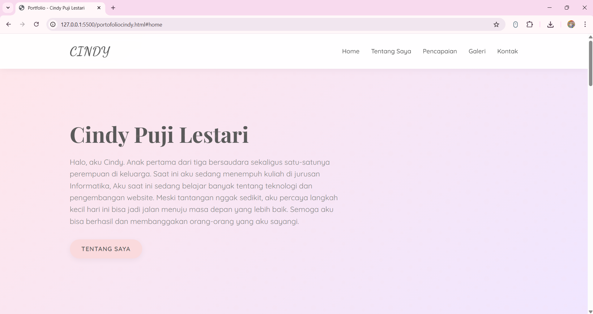
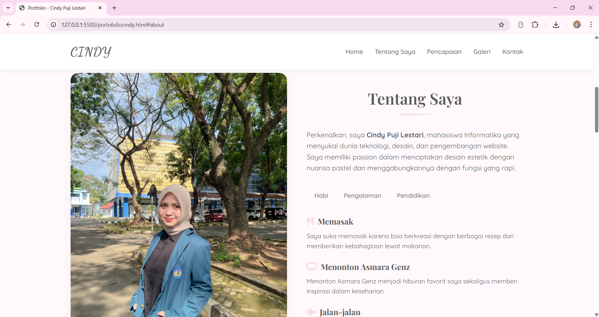
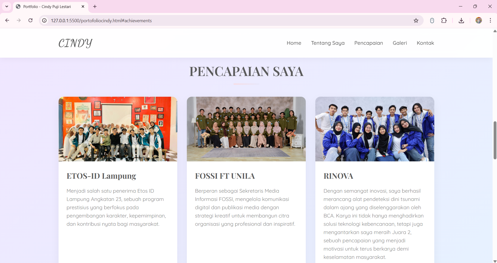
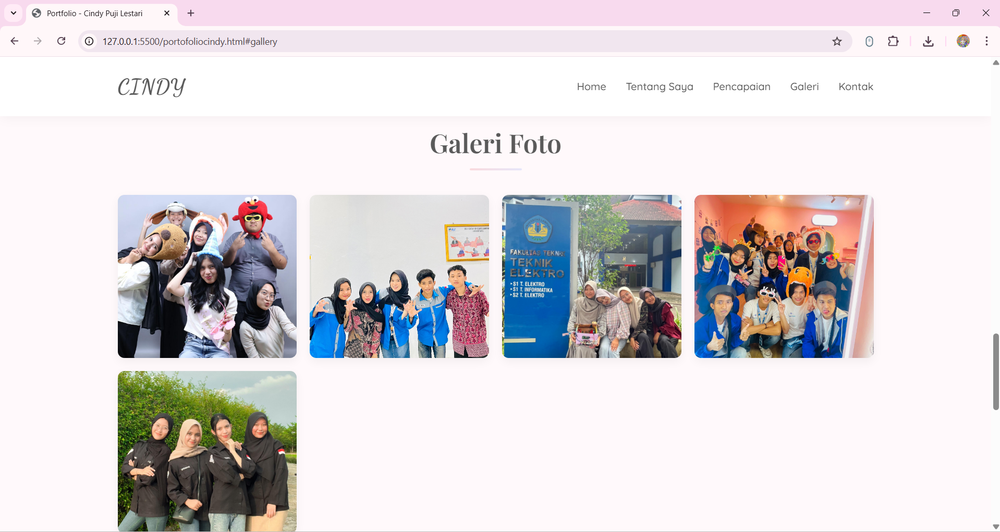
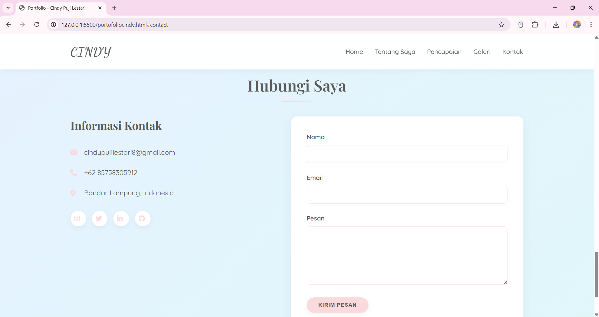

# Portfolio - Cindy Puji Lestari

Selamat datang di repositori portofolio Cindy Puji Lestari sebuah website portofolio personal yang dirancang dengan estetika pastel, layout responsif, dan struktur sederhana sehingga mudah dipelihara dan dipublikasikan.

Website ini dibuat sebagai showcase pribadi untuk memperlihatkan profil, pencapaian, galeri, dan informasi kontak.

## Ringkasan

- Nama proyek : Portfolio Cindy Puji Lestari
- Pemilik : Cindy Puji Lestari
- Tipe : Static website (HTML, CSS)
- Lokasi file utama : `portofoliocindy.html`
- Tujuan : Menampilkan profil personal, pendidikan, pengalaman organisasi, pencapaian, foto galeri, dan kontak.

## Fitur utama

- Halaman beranda (Hero) dengan deskripsi singkat.
- Bagian "Tentang Saya" dengan tab Hobi, Pengalaman, dan Pendidikan (CSS-only tabs).
- Bagian Pencapaian (achievements) dengan kartu proyek.
- Galeri foto responsif.
- Form kontak statis.
- Desain responsif untuk berbagai ukuran layar.

## Teknologi yang digunakan

- HTML5
- CSS3 (variabel CSS, responsive media queries)

## Struktur proyek

```
portofolio/                      # root project
├─ portofoliocindy.html          # file HTML utama
├─ style.css                     # stylesheet utama
├─ README.md                     # (Anda sedang melihat ini)
├─ img/                          # folder gambar (foto, ikon proyek, dsb)
```

## Dokumentasi Halaman

1. **Beranda**
   
2. **Tentang Saya**
   
3. **Pencapaian**
   
4. **Galeri**
   
5. **Kontak**
   

## Cara publish ke GitHub (GitHub Pages)

1. Buat repository baru di GitHub (mis. `portofoliocindy`).
2. Di folder proyek lokal, inisialisasi git dan push ke remote (ganti URL remote dengan milik Anda):

```powershell
cd C:\xampp\htdocs\portofolio
git init
git add .
git commit -m "Initial commit: portfolio Cindy"
git branch -M main
git remote add origin https://github.com/CindyPL25/portofoliocindypujilestari.git
git push -u origin main
```

3. Aktifkan GitHub Pages di repository:
   - Buka Settings -> Pages -> Source -> pilih branch `main` dan folder `/ (root)` -> Save.
   - Setelah beberapa menit, website akan tersedia di `https://<username>.github.io/<repo>/`.

## Cara berkontribusi

Jika Anda ingin membantu meningkatkan website ini:

1. Fork repository ini.
2. Buat branch fitur: `git checkout -b feature/nama-fitur`.
3. Lakukan perubahan dan commit.
4. Buka Pull Request ke repository utama.

Mohon sertakan screenshot atau penjelasan singkat untuk perubahan desain.

## Kontak

Jika perlu bantuan lebih lanjut atau ingin saya menambahkan fitur, hubungi:

- Email: cindypujilestari8@gmail.com

---
